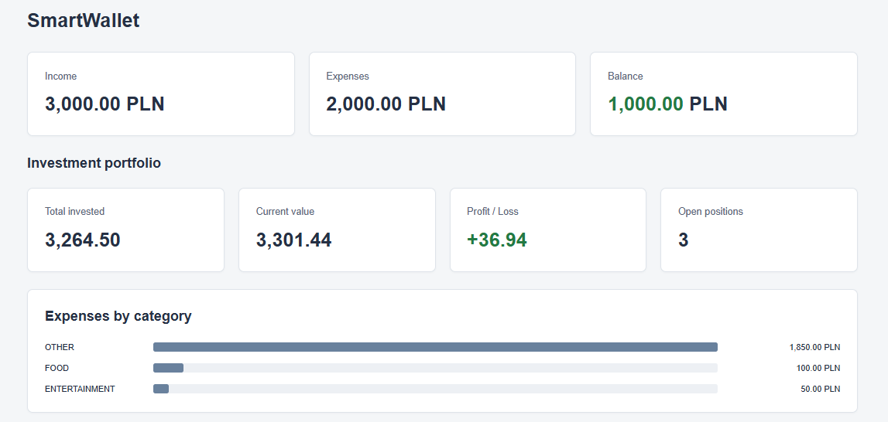
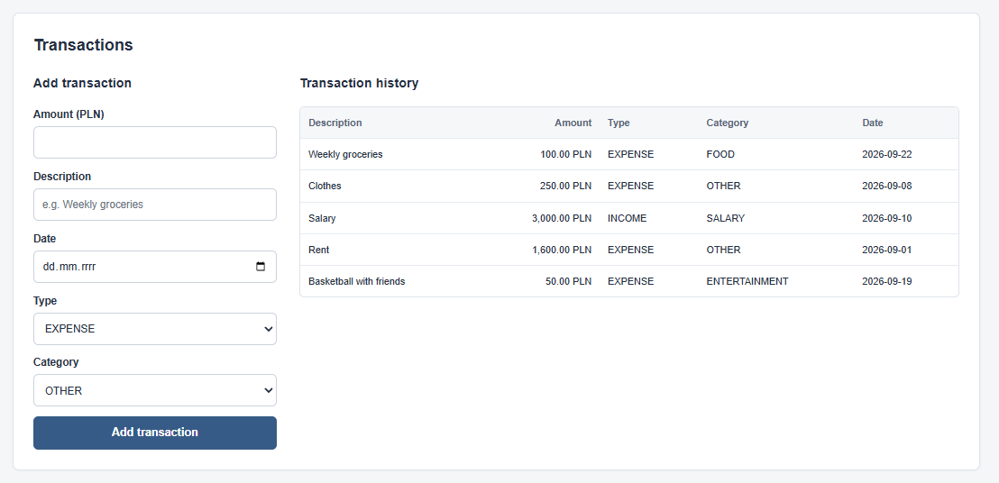
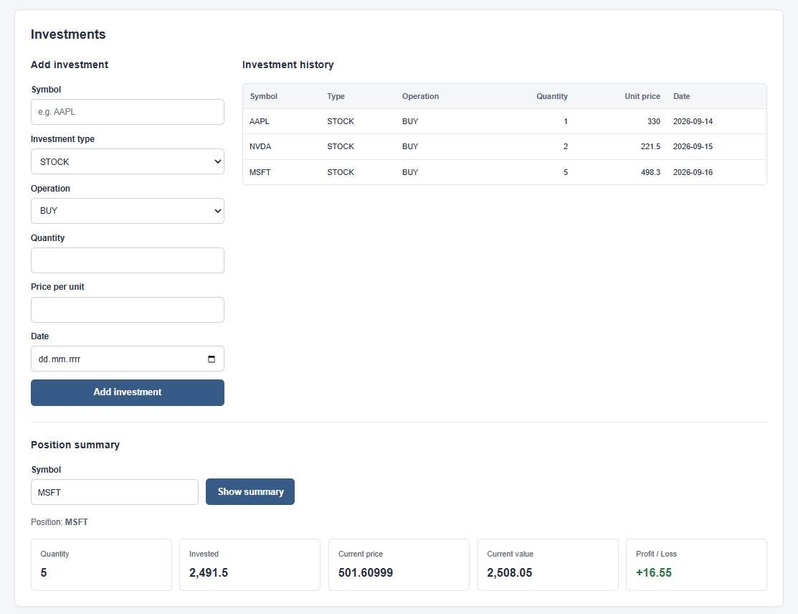
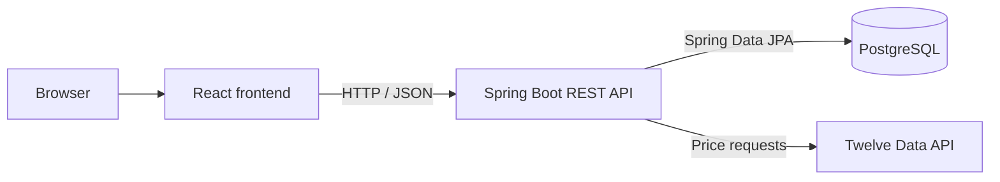

<h1 align="center">SmartWallet</h1>

<p align="center">
  Personal finance and investment tracking application built with<br>
  Spring Boot, React and PostgreSQL.
</p>

<p align="center">
  
  
  
  
  
</p>

<p align="center">
  
</p>

## Overview

SmartWallet is a full-stack personal finance application for recording income, expenses, and investment transactions. A Java 21 / Spring Boot backend provides a REST API, persists data in PostgreSQL, and retrieves market prices from Twelve Data. A React dashboard presents transaction history, spending by category, and investment summaries.

The project focuses on backend development: separating HTTP handling from business logic, querying relational data, validating requests, integrating an external API, and testing service and web layers. The frontend connects these capabilities into a single interface for tracking personal finances and reviewing a portfolio.

### At a glance

- Spring Boot REST API with validated requests and service-layer business logic.
- PostgreSQL persistence through Spring Data JPA.
- Investment valuation using prices from Twelve Data.
- Full-stack environment orchestrated with Docker Compose.

---

## Key Features

### Transactions

- Create, retrieve, update, and delete income and expense records through the REST API.
- Filter records by type, category, and an inclusive date range using JPA Specifications.
- Calculate total income, total expenses, and balance.
- Add transactions and view their history in the frontend, with an expense breakdown by category.

### Investments and portfolio

- Record buy and sell operations with a symbol, investment type, quantity, unit price, and date.
- Create, retrieve, update, and delete investment records through the REST API.
- Reject a new sell operation when its quantity exceeds the current holding.
- Retrieve current prices through the backend's Twelve Data integration.
- Calculate quantity, net invested amount, current value, and profit/loss for a symbol.
- Display portfolio totals and the number of open positions, alongside investment history and a symbol lookup form.

The frontend currently supports adding and viewing records. Editing, deletion, and transaction filtering are available through the API.

### Validation and error handling

- Bean Validation checks required fields and positive amounts, quantities, and unit prices.
- A shared exception handler returns field-level validation messages with HTTP `400`.
- Domain exceptions map invalid date ranges and insufficient holdings to `400`, missing records to `404`, and handled market-data failures to `502`.
- The frontend displays loading, saving, empty, and error states.

### Docker environment

- Docker Compose runs PostgreSQL, the Spring Boot API, and the frontend together.
- Multi-stage Docker builds package the backend as a JAR and serve the compiled frontend through Nginx.
- PostgreSQL uses a persistent named volume and a health check before backend startup.

## Application Preview

### Transactions

<p align="center">
  
</p>

### Investments

<p align="center">
  
</p>

## Tech Stack

| Area | Technologies |
| --- | --- |
| Backend | Java 21, Spring Boot 4.1.1, Spring Web MVC, REST API |
| Persistence | Spring Data JPA / Hibernate, PostgreSQL 18 |
| Validation | Jakarta Bean Validation, Spring exception handling |
| Market data | Twelve Data API, Spring `RestClient` |
| Backend tests | JUnit Jupiter, Mockito, MockMvc, Spring Boot Test |
| Frontend | React 19, TypeScript, Vite, CSS |
| Infrastructure and tools | Docker, Docker Compose, Nginx, Gradle, npm, Git / GitHub |

## Architecture



The backend is organized by domain (`transaction` and `investment`). Controllers accept validated request records and delegate to services. Services implement calculations and business rules, while repositories handle persistence and aggregate queries.

Financial calculations use `BigDecimal`; entity updates use transactional service methods. `TwelveDataClient` encapsulates requests to the external `/price` endpoint.

The frontend runs in the browser and calls `http://localhost:8080` directly. Both controllers allow the local frontend origin, `http://localhost:5173`.

### Valuation model

- **Current quantity:** bought units minus sold units.
- **Net invested amount:** purchase amounts minus sale proceeds.
- **Current value:** current quantity multiplied by the price returned by Twelve Data.
- **Profit/loss:** current value minus net invested amount.

Portfolio totals include only symbols with a positive current quantity. They exclude closed positions.

The application does not track or convert currencies, so meaningful portfolio totals require amounts in a consistent currency. Income and expense amounts are displayed as PLN in the frontend.

## Project Structure

```text
SmartWallet/
├── Backend/
│   ├── src/main/java/com/jkweg/smartwallet/
│   │   ├── transaction/       # Transaction API, business logic, and persistence
│   │   ├── investment/        # Investment API, valuation, and market-data client
│   │   └── exception/         # Shared validation error handling
│   ├── src/main/resources/    # Application configuration
│   ├── src/test/java/         # Service, controller, and context tests
│   ├── build.gradle
│   └── Dockerfile
├── Frontend/
│   ├── src/                   # React dashboard, forms, and styles
│   ├── package.json
│   └── Dockerfile
├── .env.example
├── docker-compose.yml
└── README.md
```

---

## API Overview

Base URL: `http://localhost:8080`. Request and response bodies use JSON.

### Transactions

| Method | Endpoint | Description |
| --- | --- | --- |
| `POST` | `/transactions` | Create an income or expense record |
| `GET` | `/transactions` | List records; optionally filter by `type`, `category`, `from`, and `to` |
| `GET` | `/transactions/{id}` | Retrieve a record |
| `PUT` | `/transactions/{id}` | Update a record |
| `DELETE` | `/transactions/{id}` | Delete a record |
| `GET` | `/transactions/balance` | Return income minus expenses |
| `GET` | `/transactions/summary` | Return total income, total expenses, and balance |
| `GET` | `/transactions/types` | List transaction types |
| `GET` | `/transactions/categories` | List transaction categories |

Example filter:

```http
GET /transactions?type=EXPENSE&category=FOOD&from=2026-09-01&to=2026-09-30
```

Dates use `YYYY-MM-DD`. The balance and summary endpoints aggregate all transactions independently of list filters.

### Investments

| Method | Endpoint | Description |
| --- | --- | --- |
| `POST` | `/investments` | Create a buy or sell record |
| `GET` | `/investments` | List investment records |
| `GET` | `/investments/{id}` | Retrieve an investment record |
| `PUT` | `/investments/{id}` | Update an investment record |
| `DELETE` | `/investments/{id}` | Delete an investment record |
| `GET` | `/investments/{symbol}/quantity` | Return the current holding quantity |
| `GET` | `/investments/{symbol}/net-invested` | Return purchases minus sale proceeds |
| `GET` | `/investments/{symbol}/current-price` | Fetch a price from Twelve Data |
| `GET` | `/investments/{symbol}/summary` | Return a position's quantity, investment, price, value, and profit/loss |
| `GET` | `/investments/portfolio-summary` | Return totals for open positions and their count |
| `GET` | `/investments/types` | List investment types |
| `GET` | `/investments/operation-types` | List buy/sell operation types |

Successful creation returns `201 Created`; deletion returns `204 No Content`.

---

## Running the Project

### Prerequisites

- Docker with Docker Compose, or Docker Desktop with Linux containers enabled.
- Git to clone the repository.
- A Twelve Data API key for market-price requests.

Java and Node.js are supplied by the Docker build images; local installations are not required for this workflow.

### Setup

1. Clone the repository:

   ```sh
   git clone https://github.com/jkweg/SmartWallet.git
   cd SmartWallet
   ```

2. Copy `.env.example` to `.env` in the repository root:

   ```sh
   cp .env.example .env
   ```

   In PowerShell, use `Copy-Item .env.example .env`.

3. Replace the placeholders in `.env`:

   ```dotenv
   DB_PASSWORD=your_local_database_password
   TWELVE_DATA_API_KEY=your_twelve_data_api_key
   ```

   Compose passes these values to the containers. The API key is used by the backend. `.env` is excluded from Git.

4. Build and start the services:

   ```sh
   docker compose up --build
   ```

5. Wait for the backend to finish starting, then open the application:

   - Frontend: [http://localhost:5173](http://localhost:5173)
   - Backend base URL: [http://localhost:8080](http://localhost:8080)
   - Example API request: [transaction summary](http://localhost:8080/transactions/summary)

Hibernate creates or updates the database schema on startup using `ddl-auto=update`. PostgreSQL is accessible within the Compose network; its port is not published to the host.

Price and valuation requests require access to Twelve Data and a usable key for the requested symbol. Use consistent symbol spelling when entering records and looking up positions, for example `AAPL`.

To stop the services while retaining database data:

```sh
docker compose down
```

## Testing

The backend includes:

- **Service tests:** transaction summaries, date-range validation, repository delegation for filters, investment creation and modification, deletion, missing records, insufficient holdings, and position valuation. Dependencies are mocked with Mockito.
- **Web-layer tests:** `@WebMvcTest` and MockMvc verify selected JSON responses, creation status codes, validation failures, and missing investment records using mocked services.
- **Application context test:** `@SpringBootTest` checks that the Spring application context loads.

With JDK 21 installed, run the service and controller tests from `Backend/` without a database or live market-data calls:

```sh
cd Backend
./gradlew test --tests '*ServiceTest' --tests '*ControllerTest'
```

On Windows PowerShell, use `.\gradlew.bat` in place of `./gradlew`.

To include the application context test:

```sh
./gradlew test
```

The full suite requires a reachable PostgreSQL database and `DB_PASSWORD` and `TWELVE_DATA_API_KEY` in the test process environment. Set `DB_URL` and `DB_USERNAME` if they differ from the defaults (`jdbc:postgresql://localhost:5432/smartwallet` and `postgres`).

Gradle does not automatically load the root `.env`, and the Compose database does not expose a host port. The Docker image build runs `bootJar`, so building the application with Compose does not execute the tests.

## Possible Improvements

- Add frontend controls for the existing update, delete, and transaction-filter endpoints.
- Extend holdings validation to investment edits and deletions.
- Add PostgreSQL integration tests and tests for market-data failures.
- Cache market prices to reduce repeated external requests.

## Purpose

SmartWallet is a practical full-stack learning project with an emphasis on Java and Spring Boot backend development, relational persistence, external API integration, and automated testing.
